
<h1 align="center">鲸落文化线上体验馆+vue</h1>

## 简介
鲸落文化线上体验馆：角色分为管理员、用户；功能包括用户管理、视频分类管理、制作视频管理、趣味视频管理、系统管理，提供线上文化艺术互动和学习体验。    --计算机毕业设计源码；毕设源码；java毕业设计源码

## 联系方式

<h3 align="center">获取完整代码与数据库文件 + 微信：deepguan QQ: 86050149 QQ群: 783742310</h3>

<h3 align="center">可帮忙远程部署 包运行成功！提供远程部署、修改代码、设计文档指导、代码讲解等服务！</h3>

## 功能介绍（完整见运行截图）
管理员：基本功能包括进入个人中心、用户管理、视频分类管理、系统管理以及退出登录。可以在个人中心修改用户信息和密码，借助用户管理界面对用户信息做出如禁言、删除等操作。在视频管理模块中，管理员可以添加、编辑和删除视频，并对其进行分类和管理。支持导航至系统前台和后台以便于行政管理和内容更新。

用户：基本功能涉及到浏览和上传内容，访问首页、制作视频、趣味视频、历史背景、趣味故事等栏目。在个人中心，用户可以查看和修改个人信息，同时可以浏览各种分类的视频、历史背景及趣味故事的内容。用户界面设计简洁，易于进行文件上传与日期选择等交互操作，通过点赞或踩下推动社区交流，提供便捷的在线文化和学习体验。

## 运行截图
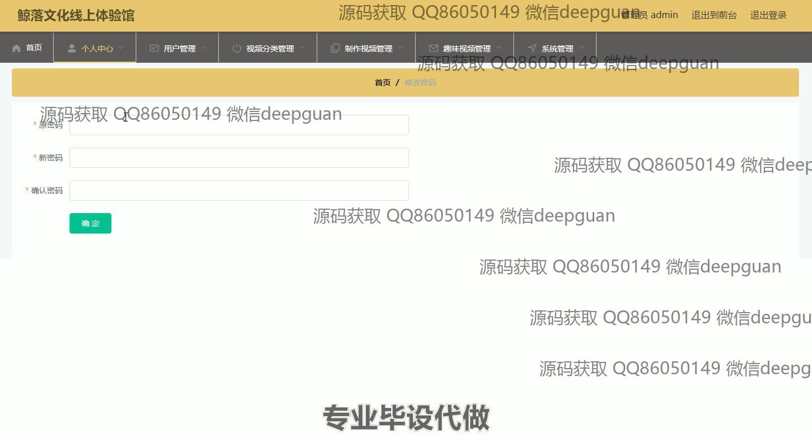
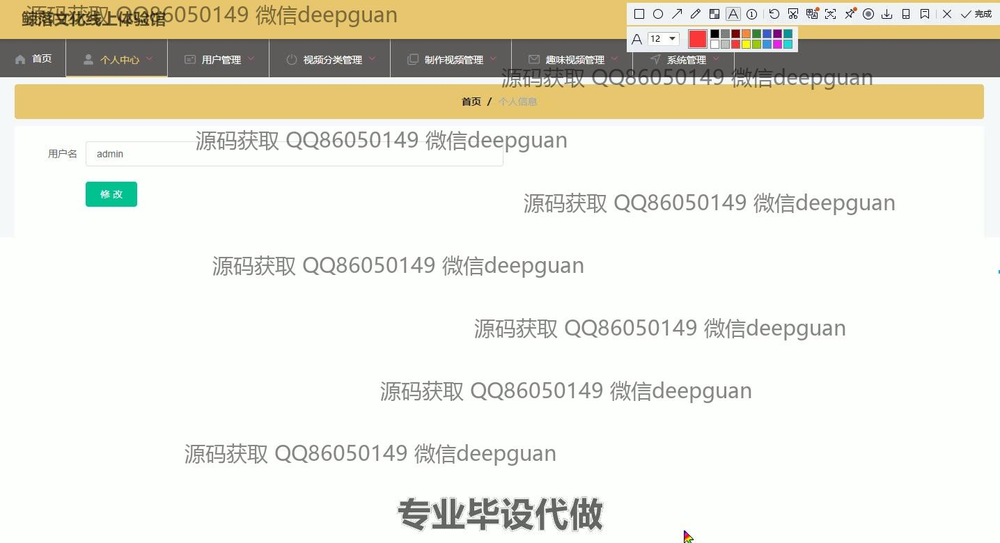
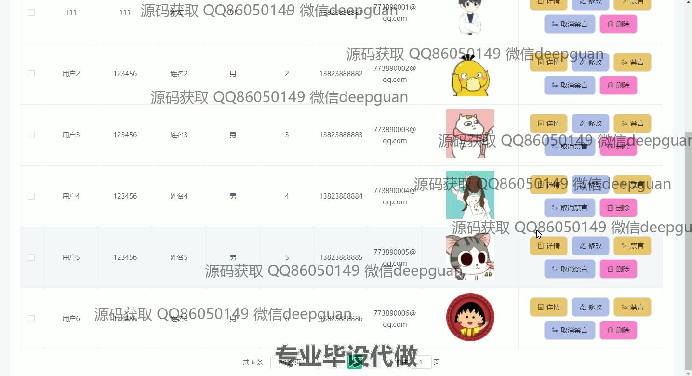
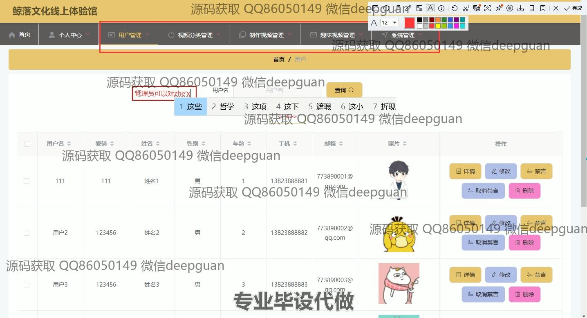
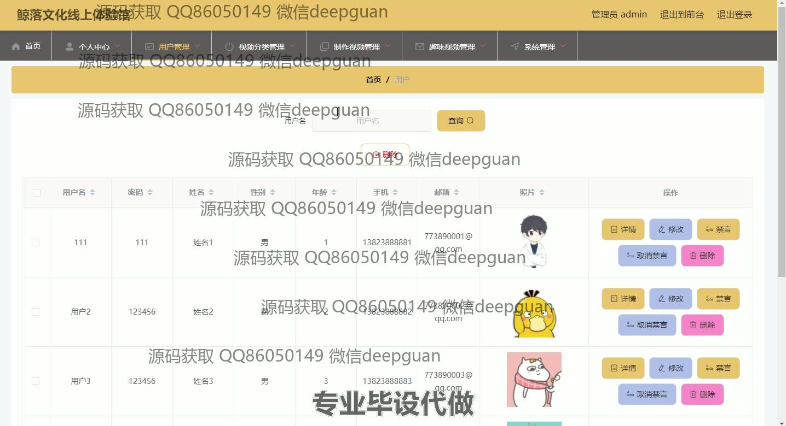
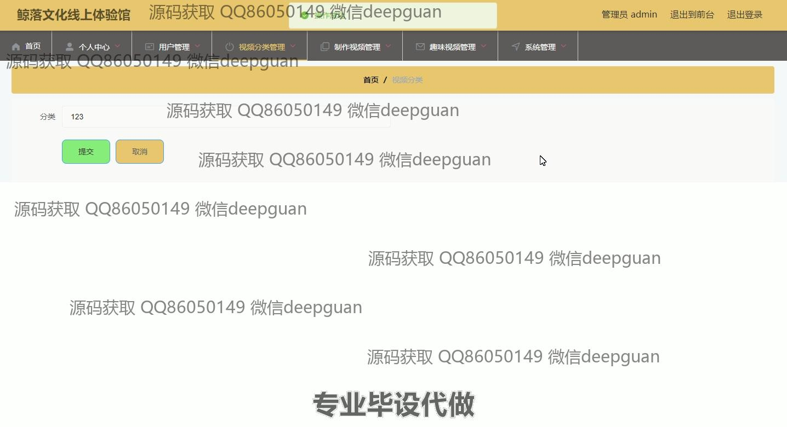
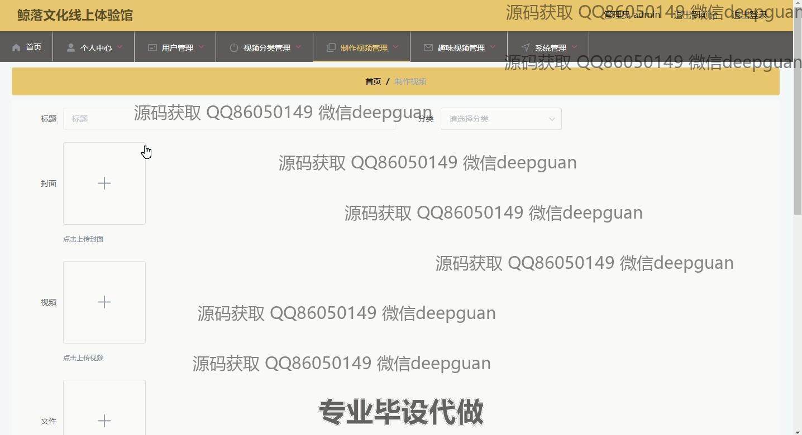
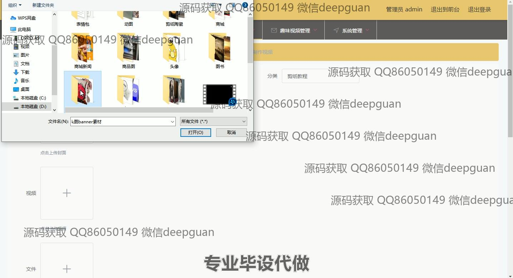
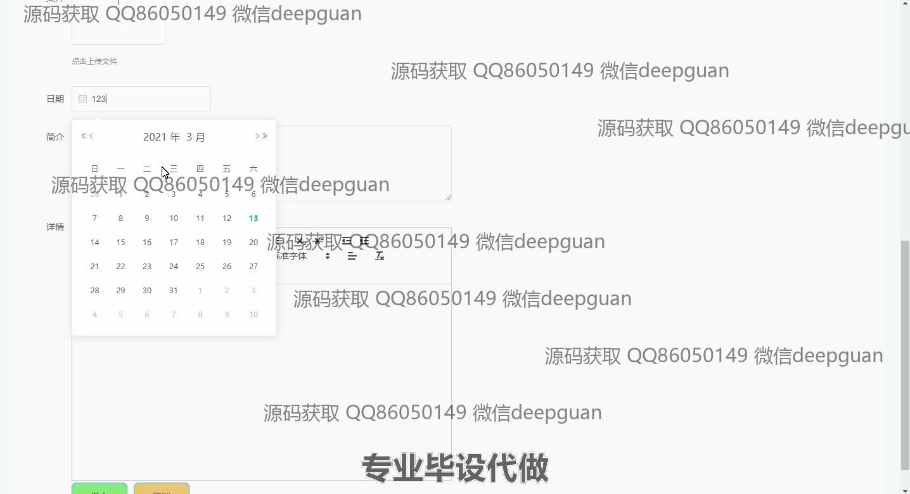
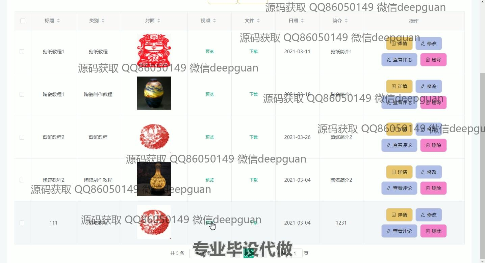
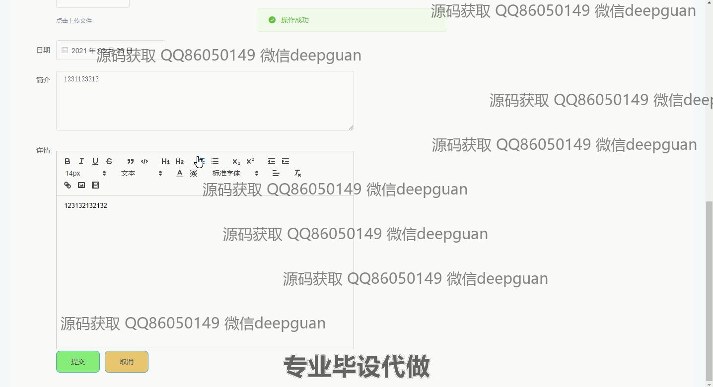
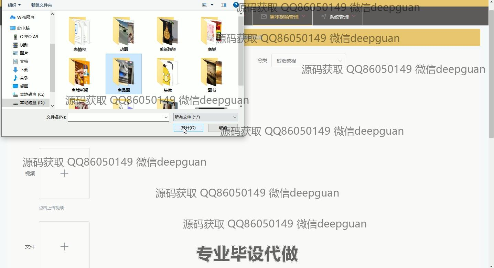
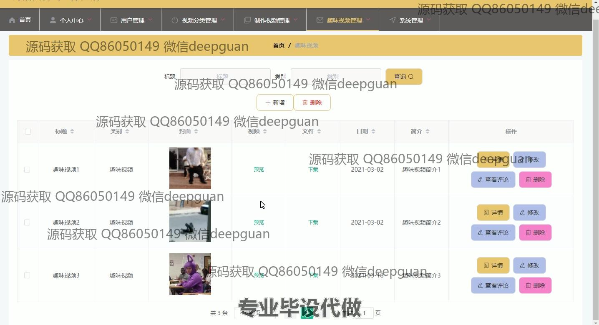

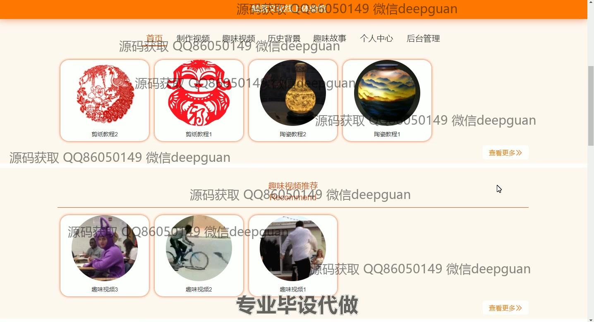
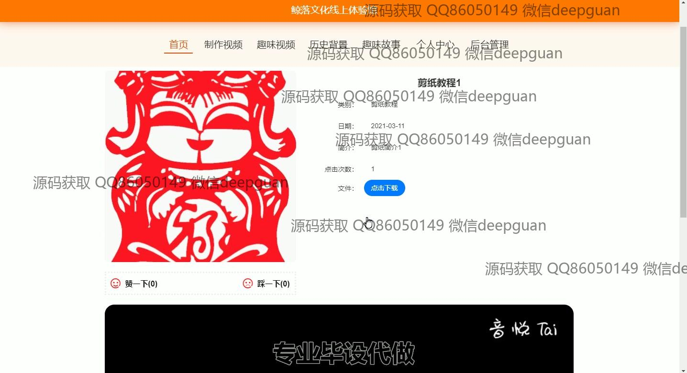

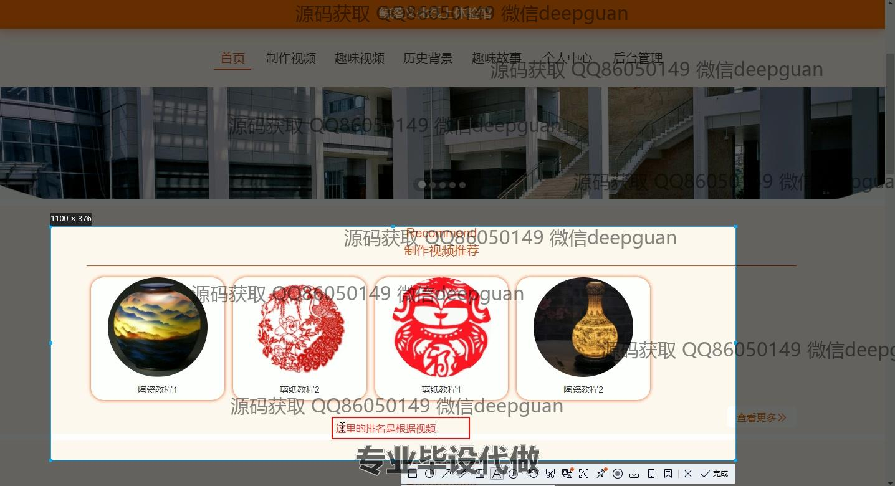

本代码来源于网络,仅供学习参考使用!

